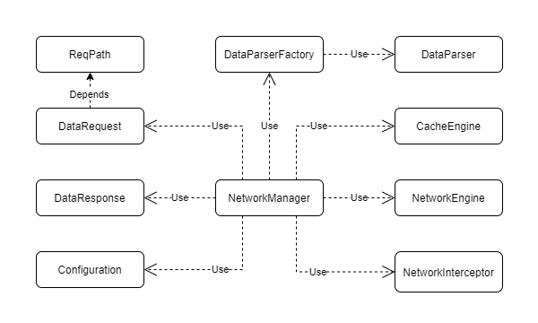

# Network - Core

- Module responsible for platform-independent networking codebase.
- This module contains the codebase which are core of the networking library.

## Components

## DataRequest

- This is a POJO/Data class containing the details regarding the request to be made.
- This class would contain the following details:
    - ReqPath - Path to which the network request would be made
    - method - Http Method (GET | POST | PUT)
    - headers - HTTP headers (like content type, cookies, auth headers, etc.)
    - body - Body for the request
    - responseClass - Class reference to cast the response with the help
      of [DataParser](https://www.notion.so/Accelerator-Network-Module-design-eab00de0727244958a1fd5473a61b407)
      .
    - cachePolicy - (NetworkOnly | CacheOnly | CacheFailsThenNetwork | CacheNetworkParallel)

## DataResponse

- This is a POJO/Data class containing the response data.
- This class would contain:
    - Body - Response body
    - headers - HTTP headers from the server
    - statusCode - HTTP status code
    - source - Cache/Network

## ReqPath

- This component would allow us to create full URL with the help of base URL.
- This would also allow to developers to create the full URL by joining the URL segments.
- Also, this class would allow developers to add/remove query params.

## Configuration

- This component allow us to configure
  the [NetworkManager](https://www.notion.so/Accelerator-Network-Module-design-eab00de0727244958a1fd5473a61b407)
  .
- This component specify the network & cache engine, thread count, data parser factory, SSL pinning,
  timeout, etc. to be used by network manager.

## NetworkManager

- This component is responsible for request management i.e. managing duplicate ongoing requests,
  interact with network interceptor, network and cache engines.
- This component would also be responsible for handling the HTTP redirections (3xx status code).
- This component would take the request data and would return the response wrapped with a
  promise/flow for consumption and cancellation.

## NetworkEngine

- Network engine is an abstraction over the networking logic of the platform,
  making [NetworkManager](https://www.notion.so/Accelerator-Network-Module-design-eab00de0727244958a1fd5473a61b407)
  multi-platform compatible.
- The networking module will be providing a network engine for each platform, but developer will
  have freedom of creating and using their own custom engine.

## CacheEngine

- Just
  like [Network engine](https://www.notion.so/Accelerator-Network-Module-design-eab00de0727244958a1fd5473a61b407)
  , this is an abstraction over how data is accessed and processed by the platform.

## NetworkInterceptor

- This component can be used to process and intercept the outgoing request and incoming response.
- This network interceptor can be used for Analytics, Encryption, etc.

## DataParserFactory

- This component would use factory pattern to provide the appropriate DataParser for specific
  response content type.

## DataParser

- This component would parse the response text into the required classes (POJO/Data class).
- An example of this would be JSONDataParser, XMLDataParser, etc.

## Features

- Platform-independent, can have platform specific engines and everything else would be
  platform-independent.
- Dynamic engine, incase the existing engines does not satisfy the development requirement, then the
  dev can create their own engine implementation.
- Single configuration for multiple platform - Developer would need to specify a single
  configuration for using the library for multi-platform.
- Handles HTTP redirections (HTTP status code 3xx)
- Could intercept each network request to provide additional logic into network manager.
- Multiple response content type support (JSON, XML, etc.)
- Unit tests support - This module would provide a test implementation to mock request and response
  in test environment.

## How it would work for multi-platform

- Most of the classes & interfaces except the engine classes (NetworkEngine and CacheEngine) are
  generic classes which would be the part of core kotlin networking module.
- The developers can simply add the dependency for core kotlin networking module and start using the
  networking module irrespective of platform.
- Whereas there will be separate libraries for each platform containing the engines related kotlin
  code specific to those platform.
- The developer then can add the dependency for the platform specific engine and then inject/provide
  the engine for the specific platform.
- This injected engines would be send to the network manager's constructor.

## Documentation:

https://www.notion.so/ymedialabs/Accelerator-Networking-Module-Documentation-f9d14919cd2a45c0943af4205a2489ec